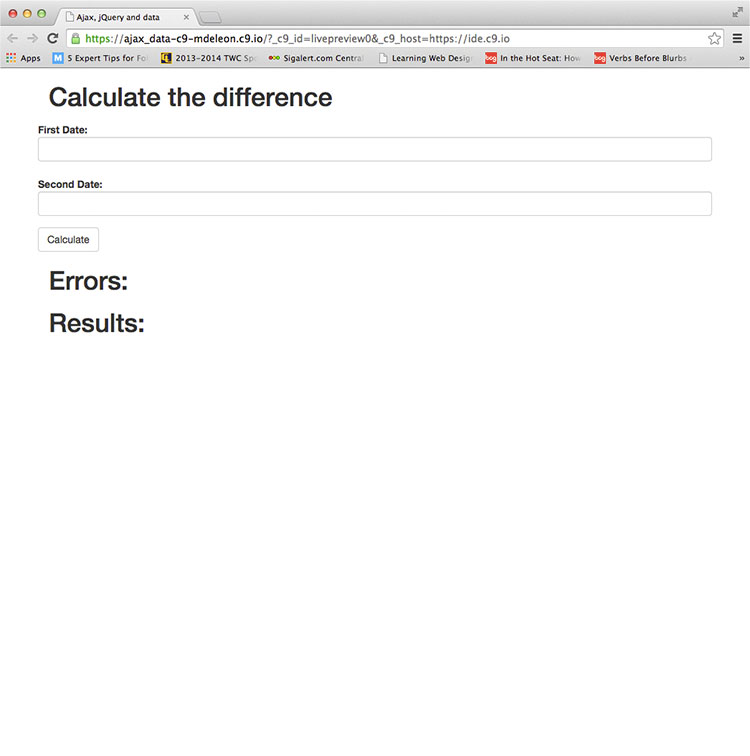
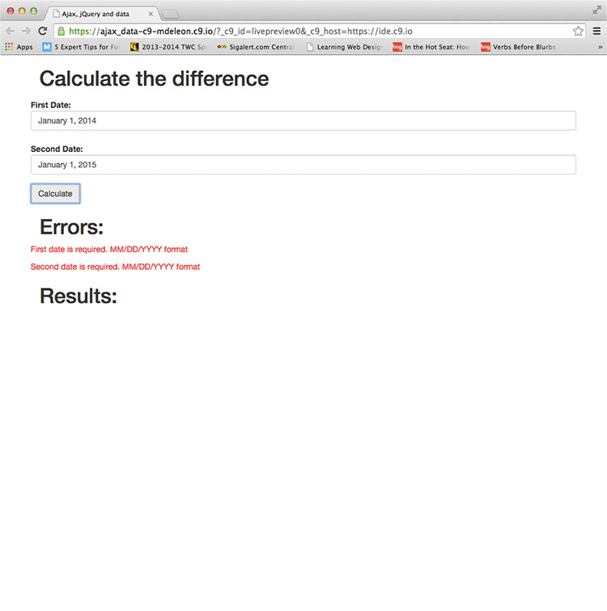
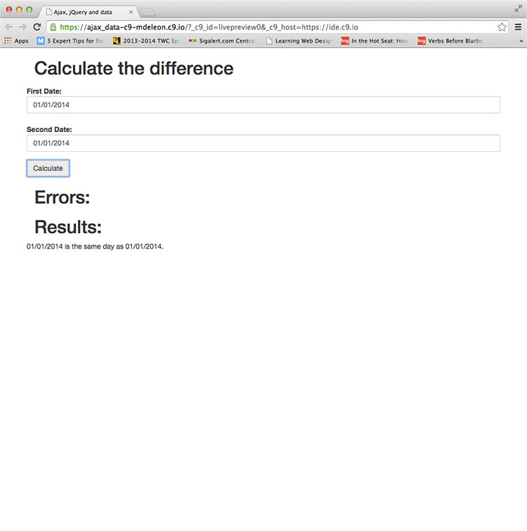

  
`School Work - Advanced Web Design Class - ITI-323`  

# Dates:  
2013 - 2014  
# Technologies:  
Cloud9, HTML5, CSS3, Bootstrap 3, AJAX, jQuery  
# Description:  
This assignment calculates the number days between 2 dates using AJAX calls to a PHP file.  The site was created with HTML5, CSS3, Bootstrap 3, AJAX and jQuery in [Cloud9 - https://c9.io](https://c9.io/).  
# Screenshots:
  

  

  

  

  
